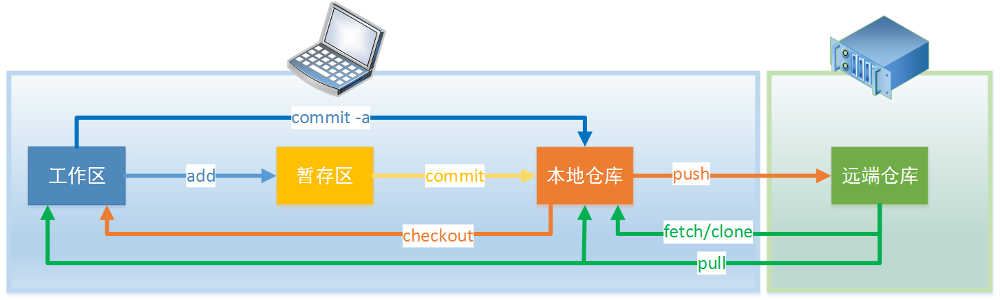

# 代码版本管理-Git快速入门

## 安装

1. Git for windows <https://git-scm.com/download/win>
1. TortoiseGit <https://tortoisegit.org/>

## 文档

1. Git命令行手册 <https://git-scm.com/docs>
1. 《Pro Git》中文第2版 <https://git-scm.com/book/zh/v2>

## 基础概念

### 代码流动的过程

1. 工作区（Working area）：项目的工作目录。
1. 本地仓库(Local repository)：项目的根目录下的.git目录，里面存储了版本信息以及文件历史版本。
1. 暂存区(Stage 或 index)：.git目录下的index文件(文件的实际内容在另外的objects目录存储)。
1. 远端仓库（origin 或者 remote repository）：不在本地的.git目录。

* 在工作区修改内容，随时可以将修改通过`git add`保存到暂存区
* 新增文件以及修改文件都是通过add加入暂存区
* 同一个文件可以多次add到暂存区
* 当暂存区的工作可以作为成果提交时，通过`git commit`提交到本地仓库(commit时需要写说明；一次commit可以包含多个文件)
* 修改也可以直接通过`git commit -a`提交到本地仓库（这儿-a是add的意思，不是all）
* 本地仓库的修改通过`git push`发布到远端
* 远端仓库的代码可以通过`git fetch`获取到本地仓库，再通过`git merge`或`git rebase`和本地代码合并
* 远程仓库代码也可以通过`git pull`获取后直接完成合并

### 分支

* 代码隔离方案，对文件的修改只影响当前分支。其余分支不受影响。
* 远端分支和本地分支即便是同名也不是一个分支，代码仍然要合并。

## 常用操作

TortoiseGit很多操作在弹出菜单或者弹出的对话框中，使用时多用右键和双击来打开。

### 仓库操作

1. 创建仓库：  
    * 直接本地创建一个：
        * 命令行：`git init`
        * TortoiseGit：在文件夹右键弹出菜单中选择`Git create repository here`
    * 从远程clone一个：
        * 命令行：`git clone <repo_url>`
        * TortoiseGit：在文件夹右键弹出菜单中选择：`Git clone`。
    * 只clone某个分支：
        * 命令行：`git clone <repo_url> -b <branch_name> --single-branch`
        * TortoiseGit：在文件夹右键弹出菜单中选择：`Git clone`时勾选branch后输入要获取的分支名称(和命令行的有点区别，这儿是获取所有分支后切换到指定分支)。
1. 远端仓库：
    * 查看所有已经关联的远端仓库：`git remote -v`。可以看到远端仓库的url。
    * 查看某个远端仓库的详细信息：`git remote show <主机名>`。可以看到远端仓库的分支，以及与本地分支的关系。
    * 添加远端仓库：`git remote add <主机名> <网址>`
    * 删除远端仓库：`git remote rm <主机名>`

### 文件操作

1. 添加文件：  
    * `git add filename`加入暂存区或在要添加的文件上右键弹出菜单中选择，`TortoiseGit->Add`。
1. 本地commit：  
    * 命令行：`git commit`
    * TorgoiseGit：在文件或者文件夹空白处右键，`Git commit`，在弹出对话框输入注释后完成提交到本地repository。
        * 可以双击要提交的文件，看下点击的文件修改了哪些内容。
        * 如果本次提交和上次提交可以合并，那么提交时可以勾选`Amend Last Commit`，把上次提交合并到本次提交，
            注释内容改成包含这两次提交的，这样可以避免琐碎的提交在log上很乱。
1. 合并commit：
    在空白处右键`TortoiseGit->Show log`触发弹出窗口，选择需要合并的多个commit，
    右键菜单，`combine to one commit`(如果所选择的commit跨分支不能合并，这个菜单不会显示）。
1. 查看修改：  
    * 在文件上右键：`TortoiseGit->diff`，会弹出窗口显示这个文件和最后一次提交的差异。
    * 在目录上右键，会弹出所有修过的文件列表，双击某个文件就可以查看这个文件的修改。
    * 任意两个文件比较：选择一个文件后，选diff later，然后再选一个文件，可以比较这两个文件。
    * Working tree和前面任意一次commit比较：show log，选择commit，右键`Compare with working tree`，
    在弹出的对话框中双击要查看的文件就可以看到这两个版本的差异。
1. 版本回退：
    * 某个文件回退：
        * 放弃当前修改：
            * 未add：`git checkout -- filename` 会用最后一次`git add`或`git commit`的内容覆盖工作区内容，不会有任何提示。
            * 已add但未commit：先用`git reset`把暂存区清理了，再按照未add处理。如果只是处理某个文件，在reset之后指明文件。
            * 已commit：走revert版本回退。
        * 在要回退的文件上右键，`Revert`就可以回到上一次commit的版本，并且暂存区的修改被清掉。
        * 或`Show log`后选中某次commit，在下方的文件变更列表中选择要回退的文件，在文件名上右键，执行`Revert to this revision`，
        则文件回退到指定版本。此时文件变为修改了的状态，要再次commit到仓库。
    * 整个分支回退到某个commit：`Show log`后选中某个commit，在上方commit列表中选择要回退到的目标commit，在commit的名称上右键，
    执行`Reset master to this`，根据需要选择reset type，则master分支会回退到此commit。reset type有三种：
        * soft： head指向指定的commit；暂存区的修改保持不变；工作区的修改保持不变
        * mixed(默认值)：head指向指定的commit；暂存区的文件被指定commit上的文件覆盖；工作区的文件保持不变，如果有修改，需要再次add到暂存区后commit。[暂存区的概念前面没讲，待补充]
        * hard： head指向指定的commit；暂存区的文件被指定commit上的文件覆盖；工作区的文件被指定commit上的文件覆盖
    * 回到未来：当整个分支回退后到某个commit后，通过`show log`就无法看到这个commit之后的commit了，
    那么如果想跳转到这些看不到commit，那么在项目目录的空白处右键，`show reflog`可以看到按照日期倒序的所有操作，包括commit的id，执行的action，
    在要跳转的commit上右键，`reset master to this`就可以跳转到指定的commit了。
1. 删除文件：  
    右键菜单`TortoiseGit->delete file`
1. 打标签：
    * 创建：选择要创建tag的commit，create tag at this revision，输入标签名称和message后就可以了。一个commit可以创建多个标签。
    * 删除: show log，选择要删除tag的commit，delete tag。
    * 推送标签：默认push时不会推送标签，需要勾选上推送tag才可以。
1. 临时保存：`git stash`。执行后所有的修改都被保存到临时保存堆栈，工作区变为clear，可以切换到别的分支，当完成突发工作后切换回来，从临时保存堆栈中取出保存的工作进度。

### 分支操作

1. 查看分支
    * 查看本地分支：`git branch`
    * 查看所有分支：`git branch -a`
    * 查看和远程分支间的track关系：增加`-vv`参数

1. 创建分支
    * 基于当前分支当前commit创建：`git branch <新分支名称>`
    * 基于远程分支创建：`git branch <新分支名称> <远程分支名称(类似于origin/b1)>`
    * 创建后并切换到新分支：`git checkout -b <newBranch> <baseBranch>`

1. 切换分支
    * checkout: 切换分支。如果加上参数`-b`，那么可以在切换前创建分支。

1. 合并分支
    * merge：在A分支上merge分支B，那么会把B分之上和A分支上不一样的地方合并到一起，最终结果保存在A分支上。
    * rebase：在A分支上基于B分支进行rebase，相当于把B分支上所有A分支和B分支分叉之后的commit先提交到A分支，
    然后再把A分支上自从分叉之后的commit提交一遍，最终结果也是两个分支合并后保存在A分支上。
    其和merge不一样的地方是所有commit经过这么处理后必然是线性的了，分支图上不会出现分叉。
    （rebase之前建议A分支上做合并commit操作，避免冲突的时候，一个commit一个commit的改要崩溃）
    * 冲突(conflicts)：分支合并时同一个文件如果在两个分支上都修改了，那么就会产生冲突，需要手工把两部分的修改合并到一起。
    使用TortoiseGit可视化的编辑很方便。

1. 与远程分支建立追踪关系
    追踪关系建立后，很多操作可以省略远程分支参数，如果只有一个追踪关系，连主机名参数都可以省略。
    * 通过clone建立：本地分支默认和远程主机的同名分支建立关系。
    * 通过创建分支时建立：如果分支创建是基于远程分支创建，那么自动建立tracking关系。
    * 手动建立：`git branch --set-upstream <本地分支名> <远程分支名>`。

1. 获取更新：
    * 获取远程主机的所有分支更新：`git fetch`
    * 获取指定主机的指定分支更新：`git fetch <主机名> <分支名>`

1. 获取更新并合并：
    * 获取指定主机指定分支的更新并与本地指定分支合并：`git pull <远程主机名> <远程分支名>:<本地分支名>`，如果冒号后省略则与当前分支合并。(从来源<远程分支>到目的<本地分支>)
    * pull省略远程分支参数：`git pull <远程主机名>`，获取与本地分支有tracking关系的远程分支。如果本地分支只有一个追踪分支，则远程主机名都可以省略。
    * 采用rebase方式合并获取到的更新：`git pull --rebase <远程主机> <远程分支>:<本地分支>`

1. 推送更新：
    * 推送本地分支到指定主机指定分支：`git push <远程主机> <本地分支>:<远程分支>`。（从来源<本地分支>到目的<远程分支>）
    * 省略远程分支名推送：`git push <远程主机> <本地分支>`。
        * 本地分支存在有追踪关系的远程分支：那么会推送到这个有追踪关系的远程分支上。
        * 本地分支不存在有追踪关系的远程分支：
            * 有同名的远程分支：推送到同名的这个远程分支。
            * 没有同名的远程分支：会创建同名的远程分支，再推送到这个新建的远程分支上，但是和本地分支不会自动建立追踪关系。
    * 省略本地分支：
        * 不省略远程分支：类似于`git push origin :master`，这等于推送一个空本地分支到远程主机，相当于删除远程分支。（不建议这么使用）
        * 同时省略远程分支：类似于`git push origin`，等同于推送当前分支。
    * 省略远程主机、本地分支、远程分支：`git push`
        * 如果当前分支只有一个追踪分支，那么就推送到这个追踪分支
        * 如果当前分支有多个追踪分支，可以用-u选项指定一个默认主机，以后就不用再加主机参数`git push -u origin master`
        * Git2.0开始`git push`默认只推送当前分支，如果要推送所有有对应远程远程分支的本地分支可以把推送方式由simple改为matching方式。`git config --global push.default matching`。(建议还是用simple)
        * 如果要不管是否有对应的远程分支，本地分支都推送到远程主机，那么加上`--all`参数。
        * 默认不推送tag，如果要推送tag，那么加上`--tags`参数
    * 强行推送参数`--force`：会用本地版本覆盖远程主机版本。但是强烈不建议这么使用。

## Git flow

1. Git flow是一种git分支管理方案，参见 [Git flow(AVH version)版本管理模型研究](../../020502learn_gitflow)
1. 还有其它的分支管理模型（GitHub flow、GitLab flow等）
