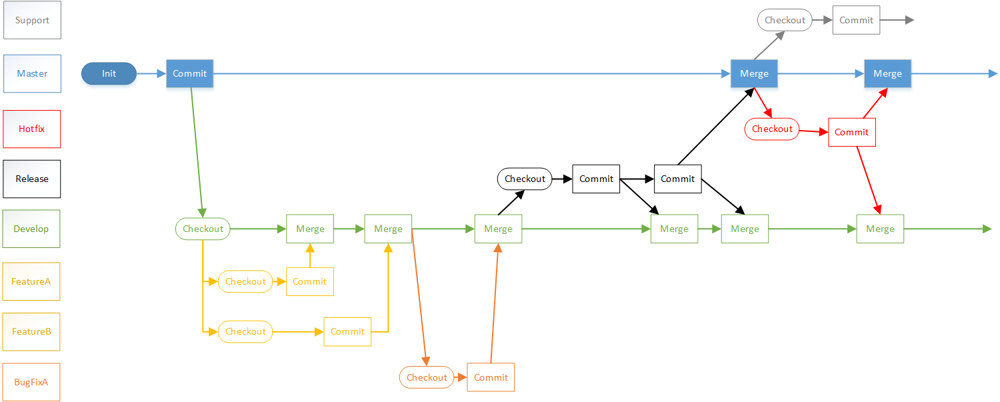

# Git flow(AVH version)版本管理模型研究

项目越来越大，分支越开越多，新特性在开发，线上bug要修复，代码版本脑子都记不过来了，
针对这些问题，基于Git版本管理出现了一些版本管理模型，Git flow就是其中的一种。

## 模型简介

起源：<http://nvie.com/posts/a-successful-git-branching-model/>  
AVH version:<https://github.com/petervanderdoes/gitflow-avh/wiki>

1. master分支：生产版本分支  
    起初我们在master上走向胜利。  
    
1. develop分支：特性集成测试分支  
    后来我们说要测试后发布才能保证质量，所以开个develop分支在这上面修改了再发布。  
    
1. feature分支：新特性分支  
    你改我也改，你要merge到master了，我才改了一半，所以分家吧，互不干扰。
    
1. bugfix分支：bug修复分支  
    develop上集成测试发现bug了，开个分支修复了合并回develop。
    
1. release分支：预发布分支  
    要发布版本了，develop上冻结，但又有新特性等待合并测试，
    再分家，发布前的工作单独在一个分支上做，修改都合并到develop上，
    确认准备完毕后合并到master上正式发布。
    
1. hotfix分支：紧急修复分支  
    线上用户反馈问题了，要紧急修复，基于master开分支修复后合并到master和develop。
    
1. support分支：长期支持分支  
    终于要升级到2.0了，但是还有用户在1.9上反馈问题，开个分支单独维护，不再合并到2.0上来。
    

PS:[原图](git flow.vsdx)

## Git flow 辅助命令
