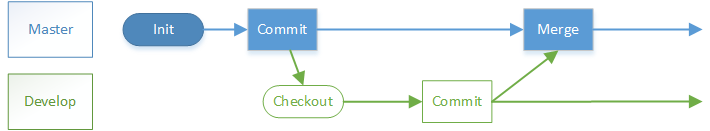

# Git flow(AVH version)版本管理模型研究

项目越来越大，分支越开越多，新特性在开发，线上bug要修复，代码版本脑子都记不过来了，
针对这些问题，基于Git版本管理出现了一些版本管理模型，Git flow就是其中的一种。

## 模型简介

起源：<http://nvie.com/posts/a-successful-git-branching-model/>  
AVH version:<https://github.com/petervanderdoes/gitflow-avh/wiki>

1. master分支：生产版本分支  
    起初我们在master上走向胜利。  
    
1. develop分支：特性集成测试分支  
    后来我们说要测试后发布才能保证质量，所以开个develop分支在这上面修改了再发布。  
    
1. feature分支：新特性分支  
    你改我也改，你要merge到master了，我才改了一半，所以分家吧，互不干扰。  
    
1. bugfix分支：bug修复分支  
    develop上集成测试发现bug了，开个分支修复了合并回develop。  
    
1. release分支：预发布分支  
    要发布版本了，develop上冻结，但又有新特性等待合并测试，
    再分家，发布前的工作单独在一个分支上做，修改都合并到develop上，
    确认准备完毕后合并到master上正式发布。(从此develop不再直接合并到master)  
    
1. hotfix分支：紧急修复分支  
    线上用户反馈问题了，要紧急修复，基于master开分支修复后合并到master和develop。  
    
1. support分支：长期支持分支  
    终于要升级到2.0了，但是还有用户在1.9上反馈问题，开个分支单独维护，不再合并到2.0上来。  
    

PS:[原图](git flow.vsdx)

## Git flow 辅助命令

从最终图上可以看到整个模型中牵扯到很多分支的创建、合并操作，
这个过程中又要主要代码更新合并，很容易出错，为了避免这种情况的发生，自然就有轮子造出来了。

### 安装

1. windows: Git for window已经包含了，可以从<https://git-scm.com/download/win>下载
1. Linux:通过以下脚本来安装，参考<https://github.com/petervanderdoes/gitflow-avh/wiki/Installing-on-Linux,-Unix,-etc.>

    ```bash
    wget --no-check-certificate -q  https://raw.github.com/petervanderdoes/gitflow-avh/develop/contrib/gitflow-installer.sh
    sudo bash gitflow-installer.sh install stable;
    rm gitflow-installer.sh
    ```

### 版本

执行`git flow version`可以看到版本，成文时的最新版本是1.10.1。

### 初始化

在项目的repo根目录下执行`git flow init --showcommands`。(--showcommands参数是显示过程中执行的git命令，更方便理解发生了什么)  
初始化之前要求所有的修改都已经commit；如果在多台机器开发，每台机器上都要执行这个初始化命令。

```bash
$ git flow init --showcommands
Which branch should be used for bringing forth production releases?
   - master  #【这儿会列出当前所有的本地分支供选择】
Branch name for production releases: [master]
git config gitflow.branch.master master #【会根据输入进行配置】
#Branch name for "next release" development: [develop]
git config gitflow.branch.develop develop  #【会根据输入配置】
git branch --no-track develop master  #【基于master创建develop分支，并且不把master作为upstream。当然默认基于本地分支创建新分支也不会建立track关系的。】【如果origin已经有了develop分支，那么直接不会有这步，不会重复创建】
git checkout -q develop #【切换到develop分支】
How to name your supporting branch prefixes?
Feature branches? [feature/]
git config gitflow.prefix.feature feature/  #【会根据输入进行配置，并不创建】
Bugfix branches? [bugfix/]
git config gitflow.prefix.bugfix bugfix/ #【配置bugfix】
Release branches? [release/]
git config gitflow.prefix.release release/ #【配置release】
Hotfix branches? [hotfix/]
git config gitflow.prefix.hotfix hotfix/ #【配置hotfix】
Support branches? [support/]
git config gitflow.prefix.support support/ #【配置support】
Version tag prefix? []
git config gitflow.prefix.versiontag  #【配置version标签的前缀】
Hooks and filters directory? [D:/gf/learn-git-flow/.git/hooks]
git config gitflow.path.hooks D:/gf/learn-git-flow/.git/hooks  #【配置钩子目录】
```

### 特性

#### 查看当前特性列表

```bash
git flow feature list
```

#### 基于develop开始新特性

```bash
$ git flow feature start --showcommands -F feature1616
git config --local gitflow.branch.feature/feature1616.base develop #【默认以develop为base】
git fetch -q origin develop:refs/remotes/origin/develop #【获取最新的develop】
git checkout -b feature/feature1616 develop #【基于develop创建新的分支并切换过去】
Switched to a new branch 'feature/feature1616'
```

会创建一个新的分支feature1616，并切换到新创建的分支上。  
-F参数是建前先fetch一下origin最新的代码。

#### 基于某个分支开始新特性

```bash
$ git flow feature start abc-1 feature/abc --showcommands
git config --local gitflow.branch.feature/abc-1.base feature/abc    #配置base为指定的base并保存在本地config中
git checkout -b feature/abc-1 feature/abc   #基于指定的base创建分支
Switched to a new branch 'feature/abc-1'
```

当指定了base时，此时会基于指定的base创建分支，并切换到新分支上。

#### 完成新特性

```bash
$ git flow feature finish --showcommands -F feature1616
git fetch -q origin develop:refs/remotes/origin/develop #【-F参数要求获取base分支最新的信息】
git checkout develop #【切换到创建时的base分支。此例中feature1616是以develop作为base创建的】
Switched to branch 'develop'
git merge --ff feature/feature1616 #【从develop分支合并feature1616特性分支的修改。采用fastforward方式】
Updating 2f13832..2295db7
Fast-forward
 README.md | 7 +++++--
 1 file changed, 5 insertions(+), 2 deletions(-)
git branch -d feature/feature1616 #【删除特性分支】
Deleted branch feature/feature1616 (was 2295db7)
```

特性完成时，会合并到创建时的base分支上，并删除特性分支。  
但是如果用多台机器开发，在A机器上创建，B机器上完成，
因为B机器上没有执行过`git config --local gitflow.branch.feature/abc-1.base feature/abc`类似的指令配置base，
默认的base就是develop，那么即使此分支的base不是develop，B机器也会把此分支合并到develop上。
要解决这个问题的方法就是 在B机器上正确的配置此分支的base。
（当然如果此分支的base在B机器上根本没有，那么也会失败。所以最好是在哪台机器开始的就在哪台结束）

#### no-ff模式完成特性

```bash
git flow feature finish --showcommands -F --no-ff feature1616
```

采用no-ff模式合并分支时，在版本图上可以看出来这儿曾经开过分支；默认采用的是ff模式，版本视图上看不出来开过分支。

#### 使用rebase方法完成特性

```bash
$ git flow feature finish --showcommands -r -F feature-rebase
Will try to rebase 'feature-rebase' which is based on 'develop'... #【准备开始进行rebase操作】
git checkout -q feature/feature-rebase #【先切换到特性分支】
git rebase develop #【在特性分支上基于develop进行rebase】
Current branch feature/feature-rebase is up to date.
git checkout develop #【再切换到develop分支】
Switched to branch 'develop'
git merge --ff feature/feature-rebase #【从develop分支上合并已经rebase过的feature分支】
Updating 254ea60..9caa210
Fast-forward
 README.md | 2 +-
 1 file changed, 1 insertion(+), 1 deletion(-)
git branch -d feature/feature-rebase #【删除被合并后的特性分支】
Deleted branch feature/feature-rebase (was 9caa210).
```

* 分支feature基于develop进行rebase，那么rebase执行完毕后分支feature上已经有了develop上的最新内容，但是develop上尚未有feature的最新内容。所以还是会再切换到develop上执行一次merge操作。
* 先rebase再切换到develop上merge的优势在于多人合作时解决代码冲突效率高，因为rebase是在自己修改的feature上执行，当代码冲突时自己最可能知道如何修改feature来解决冲突。
* 先rebase再切换到develop上merge，在版本图上也会更清晰。（个人建议都采用rebase的方法完成特性。）

特性完成后只是在本地合并了，并没有推送到origin，如果要保存到origin，还是要执行git push。
执行git push时，如果本地develop和远端develop尚未建立upstream关系，那么会提示要先建立
（执行`git push --set-upstream origin develop`，会把内容push到origin，并设置本地develop分支track远端develop分支
[可以通过`git branch -vv`看到track关系]）

#### 公开特性

```bash
$ git flow feature publish --showcommands f1836 #公开到f1836到origin上供所有人可用
git fetch -q origin #【会先fetch最新的origin信息】
git push -u origin feature/f1836:feature/f1836 #【push到远端】
 * [new branch]      feature/f1836 -> feature/f1836 #【远端创建了新分支】
Branch feature/f1836 set up to track remote branch feature/f1836 from origin. #【本地分支和远端分支建立了track关系】
git fetch -q origin feature/f1836
git checkout feature/f1836 #【切换到发布的分支】
```

* 发布分支用于多人合作开发或者多机器工作，只有分支发布到origin后，别的端才能从origin获取到这个分支。
* 在finish已发布的特性分支时也会同时请求删除远端的对应分支。如果远端对应分支已经删除了，那么finish操作就会失败。（所以如果A发布了特性，B完成特性就会造成A完成时失败。还是尽可能哪台机器创建，哪台机器完成）

#### 获取远端特性

```bash
$ git flow feature track --showcommands f1836 #从origin上获取要开发的特性f1836
git fetch -q origin #【从origin获取最新版本信息】
git checkout -b feature/f1836 origin/feature/f1836 #【基于远端创建分支】
Branch feature/f1836 set up to track remote branch feature/f1836 from origin. #【与远端建立track关系】
Switched to a new branch 'feature/f1836' #【切换到新分支】
```

当本地尚未有此特性分支时，需要从origin上获取。

#### 同步远端特性代码

就使用普通的`git pull`和`git push`即可(就是多输入个feature/目录)。

#### 删除特性分支

`git flow feature delete`

当特性分支要废弃时可以直接删除。(但是只会删除本地的，如果要删除远端分支加`-r`参数)

### Bugfix

除了名字和特性不一样，别的都一样。此分支主要是从语义上与特性分开，但是操作和特性都完全一样。

### 预发布release

#### 查看预发布列表

`git flow release list`

#### 开始预发布

`git flow release start my_release_1`  
会基于develop分支创建预发布分支，并切换到预发布分之上。

#### 公开预发布

`git flow release publish my_realse_1`  
推送预发布分支到origin上，便于其他人员提交最后的修改。

#### 获取预发布

`git flow release track my_realse_1`

#### 完成预发布，合并到master和develop

```bash
$ git flow release finish --showcommands 1.0
git checkout master #【切换到master分支】
Switched to branch 'master'
Your branch is up-to-date with 'origin/master'.
git merge --no-ff release/1.0 #【master上把要发布的内容合并过来，采用了no-ff模式】
Merge made by the 'recursive' strategy.
 README.md | 21 ++++++++++++++++++++-
 1 file changed, 20 insertions(+), 1 deletion(-)
git tag -a v1.0 #【在master上打标签】
git checkout develop #【切换到develop分支上】
Switched to branch 'develop'
Your branch is up-to-date with 'origin/develop'.
git merge --no-ff v1.0 #【develop上把要发布的内容合并过来，采用的no-ff模式】
Merge made by the 'recursive' strategy.
 README.md | 4 +++-
 1 file changed, 3 insertions(+), 1 deletion(-)
git branch -d release/1.0 #【删除发布分支】
Deleted branch release/1.0 (was e426a5c).

Summary of actions:
- Release branch 'release/1.0' has been merged into 'master'
- The release was tagged 'v1.0' #【自动加了v，因为git flow init时指定的】
- Release tag 'v1.0' has been back-merged into 'develop'
- Release branch 'release/1.0' has been locally deleted
- You are now on branch 'develop' #【停留在develop分支上】
```

* 完成预发布后并没有推送到origin上，要手工`git push`或者在完成预发布时增加`-p`参数
* 完成预发布无法使用rebase方法，因为要把内容同时合并到master和develop两个分支上。如果要rebase可以在完成前手动rebase。
* 完成预发布时可以通过参数`--ff-master`指定采用fast-forward方法与master合并（1.10.1之后的版本才支持此参数），但develop始终是no-ff合并
* 如果预发布已经公开到origin上，那么完成时也会删除origin上的对应分支。
* -s参数可以对tag进行签名防止篡改，但是需要配置key，具体可查阅git帮助。

#### 基于指定分支完成预发布

```bash
$ git flow release branch --showcommands n1.1 commonabc
git checkout master
Switched to branch 'master'
Your branch is up-to-date with 'origin/master'.
git merge --no-ff commonabc
Merge made by the 'recursive' strategy.
 README.md | 4 +++-
 1 file changed, 3 insertions(+), 1 deletion(-)
git tag -a n1.1

Summary of actions:
- Branch 'commonabc' has been merged into 'master'
- The release was tagged 'n1.1'
```

直接将指定分支内容合并进入了master；要求指定的分支不能是git flow的分支。

#### 删除预发布

`git flow release delete my_realse_1`  
会删除本地预发布分支，如果要删除远端的则加上`-r`参数。

### Hotfix紧急修复

#### 开始紧急修复

```bash
$ git flow hotfix start v1.1.2 --showcommands
git config --local gitflow.branch.hotfix/v1.1.2.base master
git checkout -b hotfix/v1.1.2 master    #基于master创建新的hotfix分支
Switched to a new branch 'hotfix/v1.1.2'

Summary of actions:
- A new branch 'hotfix/v1.1.2' was created, based on 'master'
- You are now on branch 'hotfix/v1.1.2'
```

* 会基于Master（默认）创建一个修复分支。VERSION是版本名称，比如Version0.11。
* 本地同一时间只能有一个hotfix在进行。（git flow脚本会检测）

#### 完成紧急修复

```bash
$ git flow hotfix finish v1.1.3 --showcommands
git checkout master #切换到master
Switched to branch 'master'
git merge --no-ff hotfix/v1.1.3 #合并修复内容
Merge made by the 'recursive' strategy.
 README.md | 3 ++-
 1 file changed, 2 insertions(+), 1 deletion(-)
git tag -a v1.1.3   #打标签
git checkout develop    #切换到develop
Switched to branch 'develop'
git merge --no-ff v1.1.3    #从master合并修复内容
Merge made by the 'recursive' strategy.
 README.md | 3 ++-
 1 file changed, 2 insertions(+), 1 deletion(-)
git branch -d hotfix/v1.1.3 #删除修复分支
Deleted branch hotfix/v1.1.3 (was 8e0dd25).

Summary of actions:
- Hotfix branch 'hotfix/v1.1.3' has been merged into 'master'
- The hotfix was tagged 'v1.1.3'
- Hotfix tag 'v1.1.3' has been back-merged into 'develop'
- Hotfix branch 'hotfix/v1.1.3' has been locally deleted
- You are now on branch 'develop'
```

* 完成修复时内容会先合并进入master，然后合并入develop(如果base不是master那么就不会影响master和develop)
* 通常develop此时已经有修改了，可能会代码冲突，此时就需要手工解决代码冲突
* 修复完成后如果需要推送到远端那么加`-p`参数或者手动推送

#### 从指定分支开始修复

```bash
$ git flow hotfix start --showcommands 1.2.1 support/1.2
git config --local gitflow.branch.hotfix/1.2.1.base support/1.2 #记录base
git checkout -b hotfix/1.2.1 support/1.2    #从指定base创建分支
Switched to a new branch 'hotfix/1.2.1' #切换到修复分支

Summary of actions:
- A new branch 'hotfix/1.2.1' was created, based on 'support/1.2'
- You are now on branch 'hotfix/1.2.1'
```

* 会以指定分支为base创建修复分支
* 完成修复时的处理也不一样，不会把修复合并到master和develop

    ```bash
    git flow hotfix finish --showcommands 1.2.1
    git checkout support/1.2
    Switched to branch 'support/1.2'
    git merge --no-ff hotfix/1.2.1
    Merge made by the 'recursive' strategy.
     README.md | 4 +++-
     1 file changed, 3 insertions(+), 1 deletion(-)
    git tag -a 1.2.1
    git branch -d hotfix/1.2.1
    Deleted branch hotfix/1.2.1 (was 29ed03e).

    Summary of actions:
    - Hotfix branch 'hotfix/1.2.1' has been merged into 'support/1.2'
    - The hotfix was tagged '1.2.1'
    - Hotfix branch 'hotfix/1.2.1' has been locally deleted
    - You are now on branch 'support/1.2'
    ```

#### 公开紧急修复

`git flow hotfix publish <name>`

#### 删除紧急修复

`git flow hotfix delete <name>`  
删除紧急修复，加`-r`参数则同时删除远端相应分支。

### Support长期支持

```bash
$ git flow support start 1.2 v1.2 --showcommands #start 版本 master上的commit
git checkout -b support/1.2 v1.2    #基于master上v1.2tag创建支持分支
Switched to a new branch 'support/1.2'  #切换到了新创建的支持分支
```

* 长期支持就只有start、list两个操作，如果不需要了可以手工删除
* 支持分支如果需要公开到origin，那么通过git push操作
* 支持分支创建必须基于master上的某个commit创建
